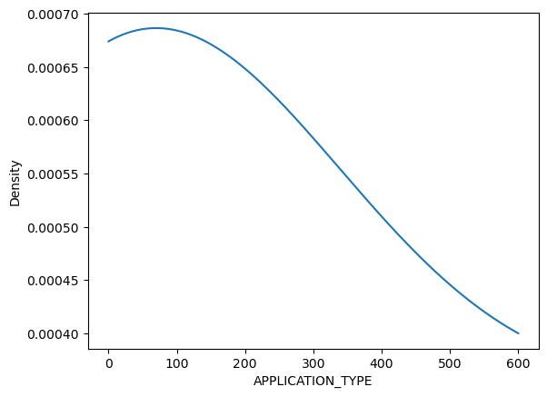
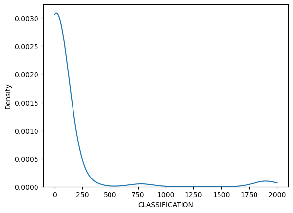
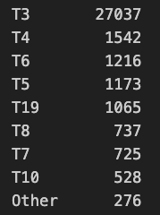
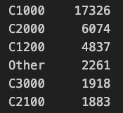
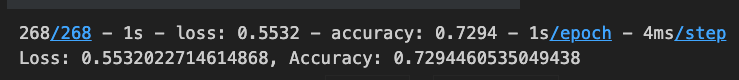
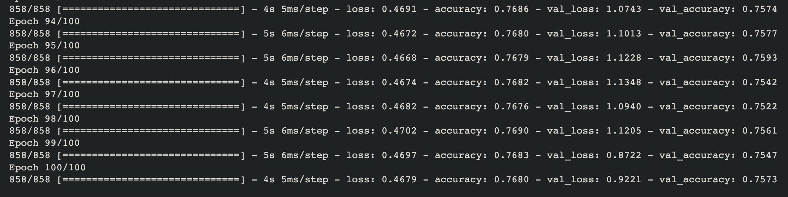
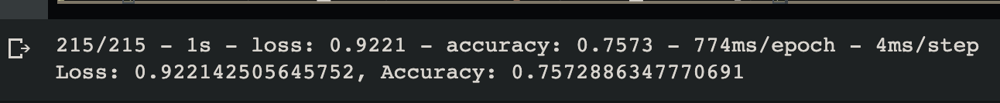

# Charity Analysis Using Neural Networks

### Overview

---

The purpose of this model was to create a binary classifier capable of predicting whether the money donated by Alphabet Soup will be successfully used or not.

## Results

---

### Target and Features

---

The Target value for this dataset was decided to be the "IS_SUCCESSFUL" column. <br>
All other columns were to be used as the Features. <br>
The two identification columns "NAME" and "EIN" were dropped, as they did not add any measurable data to help train the model.

### Preprocessing Data

---

- The .csv was loaded into a DataFrame, and all ```.nunique()``` values were explored.
- The density of ```.value_counts()``` columns "APPLICATION_DATA" and "CLASSIFICATION" were plotted to be able to see the threshold for binning the values.
  




- Value types were binned for APPLICATION_TYPE and CLASSIFICATION.




- All columns with a ```.dtype``` of **"object"** were extraced, One-Hot encoded, and merged back into the original DataFrame.
- All encoded columns were scaled, and split into training and testing datasets.

---

## Models

---

### Initial Model

---

The first model was then built, with two hidden layers. The first layer has 20 neurons, the second layer has 15 neurons. I believed this to be a good initial starting point to see where the first model evaluation ended up. <br>



The inital model completed 100 Epochs with an Accuracy of 72%. Not terrible, but for the specific purpose this model was intended for, it needs to have a higher accuracy.

### Second Model

---  

For the second model, the `keras_tuner` was used to attempt to optimize the model  
The options for the model were:  

- Neurons of either 16 or 32 in the first layer.
- Hidden layers of a range from 1 through 6, with neurons for each layer being 1 through 10 in intervals of 2.
- Activation options for all layers were either `relu, tanh,` or `sigmoid`.

The best model after performing an extensive `kt.tuner.search` was still only a **73.4%**.  
So, in conclusion, while a `keras_tuner` search was helpful for finding ideal layer and activation settings, it did not improve the model substantially. In this dataset, further pre-processing of the dataset would most likely be able to achieve an accuracy above the 75% threshold.

### Third Model

---

For pre-processing the data to `fit` the third and final model, following steps were changed from the first dataset:

- Only the "EIN" column was dropped, while the "NAME" column was left in, with the lower `.value_counts()` were binned.
- The "ASK_AMT" column was binned into three separate columns, 'below_5000', '5000', and 'above 5000', as a large majority of applicants were asking for $5000.
- The binning for the "APPLICATION_TYPE" and "CLASSIFICATION" values were also adjusted slightly.

The third model was set according to the `keras_tuner` settings, but altered slightly in order to make the most of this attempt.

- First layer was assigned 128 neurons, with an `relu` activation.
- Two hidden layers, each with 256 neurons, also with a `relu` activation.
- The `learning_rate` of the `adam` optimizer was set to .002, which was found to be optimal from an outside test.
- Epochs were initially set to **100** for the test to find the optimal `learning_rate`, but after that initial test, the epochs were lowered to **30**, which was deemed adequate to achieve the desired results, with no improvement seen past that.  

The final result was, at last, an accuracy score against the *test data* over **75%**.  
Pictured was an inital test, but without the `callback` function to save the weights, so the test was ran again with fewer epochs in order to save the weights.  
Final Result:  



---

## Summary

---

The test, while succesfully testing above the 75% threshold, is still not up to the standards I would like, personally. I believe there could be a more suitable model for binary purposes, or even something as simple as a modified SVM classifier model. While several models were considered, further time and training on my part would be necessary to be able to truly optimize the dataset.  
Another potential would be to simply leave the columns as-is, without binning, and simply encoding the *'object'* columns. More data to work with would certainly slow the model training down, but would potentially increase the accuracy by quite a bit.  
While a 75% accuracy was the threshold for a 'successful' test, the *'loss'* value was extremely high, at **92%**. That is absolutely a value that would need to be further optimized also.